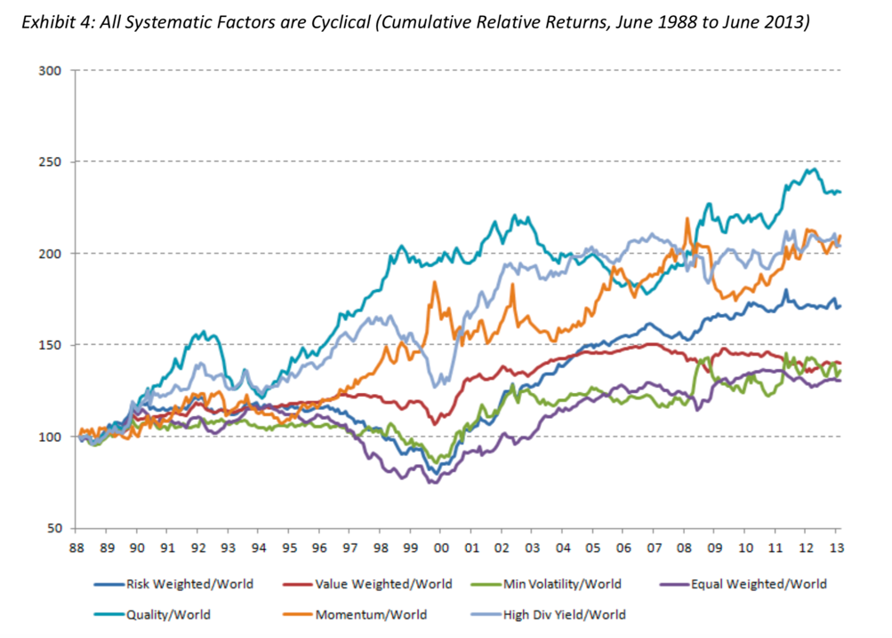

# 如何成为有钱人？

成为有钱人的一个关键事实是，真正的财富源自商业行为，靠死工资和小费成不了富翁。 ——《财富的理想国》

-----

## 财富自由

## 人个投资

### 最简单有效的投资策略

人们总以为 “选择股票” 是很困难的事情 —— 其实，**一点都不难！** 因为那所谓的 “困难”，完全是惯性思维造成的，实际上，那只不过是人们总是不肯、或者不敢使用最简单直接粗暴有效的方法的结果。这个方法太简单了，简单到令人难以置信：

直接选择市场上所有人都最看好的股票。

注意这个“最”字。在深证你就直接买万科，在上证你就买直接贵州茅台，在纳斯达克你就直接买苹果，在港交所你就直接买腾讯，在区块链交易所你就直接买比特币……

这就是交易市场的神奇之处的本质 —— 在这里，你可以利用他人的智慧。

刚才你已经看到了，普通人拿很少很少的钱也可以让世界上最优秀的公司里的最优秀的人帮他们赚钱！你知道更神奇的是什么吗？更神奇的是，你可以让整个市场上最聪明的人帮你选择。你不是不会吗？你不是不懂吗？你不是觉得自己笨吗？你不是就算不笨也需要很花时间才能学会吗？其实，你想多了，因为这些都不重要 —— 你不是佩服巴菲特吗？那你就直接去买他正在持有的公司，这就相当于是让巴菲特免费为你思考…… 当然，巴菲特也不见得是最好的，那怎么办？你可以直接选择所有人都看好的那个标的。 这就是刚才所说的，万科、茅台、苹果、腾讯、比特币，都是市场上最聪明的人们已经帮你选好了的品种 —— 并且这些最聪明的人提供的建议竟然是彻头彻尾免费的！

不用怀疑这种零成本的判断。如果整个市场最看好的标的最后竟然败了，事实上你也没有什么可怨的 —— 因为那已经是最好的建议了！同样的道理，当中烟国际 2019 年在港交所上市的时候，你直接买就是了！因为那是全中国最具现金生产能力的公司！

你知道最神奇的是什么吗？这种最简单直接粗暴且肯定有效的方法，99% 以上的人并不采用！

如果你选择了市场上最被看好的那个标的，由此产生的效果是什么你知道吗？接下来，你不需要研究，你不需要分析，你不需要独自盯盘，甚至你根本就不需要与任何人讨论，事实上，什么都不用你做，因为所有这些，都由市场上最聪明的人替你做完了，并且免费！ —— 这绝对是现代交易市场上投资者的最高境界。传闻说，茅台股东的生活也很简单，就是读书、健身、旅游、陪家人…… 这的确是真实的。

苹果现在是一家万亿美元市值的公司，过去 52 周内，苹果股票的日交易量为 28,834,582，按照 2019 年 7 月份的价格，大约 200 美元计算，苹果股票的日交易额约为 57.7 亿美元。

比特币 2019 年 7 月 10 日的流通市值大约为 2,247 亿美元，不到苹果公司的 1/4；但，比特币的当日交易额却有 294.7 亿美元，是苹果股票日交易额的 5 倍还要多…… 这差异已经不是一般的大了吧？而市值只有 50 多亿美元的 EOS，这只不过是苹果公司市值的 1/200，可它的日交易额有多少呢？是 23 亿美元，逼近苹果股票日交易额的 1/2……你说惊人不惊人？在可预见的未来，这个差异只能越来越大。

这就解释了为什么如果股票比债券更值得投资的话，那么，区块链数字资产就比股票更值得投资。

### 如何开始？

所以，对我这根已经有着八年区块链交易市场经验的正统老韭菜来说，可分享的最大经验和最大感悟就是：

重视心理建设 —— 这是唯一最重要的工作。

如何进行最优化的心理建设呢？答案是：

从进入市场的那一刻开始就只做定投。

之前也用过另外一句稍微文邹邹一点的描述：

何以解忧？唯有定投！

在此之前，多处提到定投 BOX 这类所谓 “一系列优质标的” 的好处，它们是：

有效稀释机会成本 —— 这是合格投资者必须做好的功课。
押注的标的是整个行业发展或者整个经济发展 —— 这是靠谱地找到唯一长期只涨不跌的投资标的的方式。
但是，最大的好处在这里：

采用定投策略会使任何普通人从一开始就变成被动聪明的投资者！

什么叫被动聪明呢？所谓的被动聪明，指的就是一个人可能并不聪明，但因为它选择了一个正确的方式行动，乃至于随后的一切决策和行为都自动变得更聪明。

### 长期投资策略

### 长期定投

当我们采用市场上所有的聪明人集体为我们提供的免费最佳建议之时，我们会面临另外一个尴尬，就是，只买万科、或者只买贵州茅台、苹果、可口可乐甚至中国烟草中的任何一个的话，我们面临一个严峻的问题：

只投资单个标的的机会成本无限大！

这绝对是任何普通人都能理解的概念！

所谓的机会成本，指的就是你的钱若是被用来投资了某个标的，那些钱就不能同时被用来投资另外一个标的…… 如果你用一些钱投资了 A，那么那些钱就不能同时用来投资 B，于是，B 的未来涨幅就会成为你投资 A 的那些钱未来收益的机会成本。

如果你只投资了唯一的标的，那么，你的机会成本其实是无限大的！所以，即便是彻头彻尾的小白，都可以瞬间明白为什么一定要找个什么方法去稀释机会成本！投资么，是个全面思考的技术，不能只考虑可能的收益率，除此之外，当然还要考虑风险…… 而“如何稀释机会成本”也是必须考虑的重要因素！

有没有办法呢？肯定有！一个简单的办法就是投资一系列优质标的。当你购买指数基金或者 ETF 的时候，你的投资对象不再是某一个优质企业或者项目，而是一系列优质企业或者项目！

这里有个微妙的重点被很多人忽略了。通过购买一系列优质标的，你一方面有效地稀释了机会成本，另外一方面更重要，你的投资标的的属性和质量变了！你的投资标的变成了长期来看只涨不跌的标的！

有这么神奇吗？有！绝对有。

优质企业做到基业长青是非常非常难的。再优秀的企业也有可能走向衰落。你听过的柯达你听说过的诺基亚都是如此。可口可乐、贵州茅台这样的公司极为罕见的同时，即便是他们也保不齐哪天遇到黑天鹅事件而面对灭顶之灾。所以，只投资某个最优秀的企业，一方面机会成本无限高，另外一方面也没有任何有效方法规避黑天鹅事件 —— 放到越远的长期视角来看越是如此。

但是，这世界有没有长期来看只涨不跌的标的？有的！那就是人类的经济发展。

这也是为什么长期来看，股票市场的价格指数只有一个趋势，上涨。

所以，作为普通人，你只有长期投资、长期持有才是万无一失的。

这里有个隐秘的重点：

> 没有只涨不跌的标的，只有长期来看只涨不跌的标的。

还有更为重要的关键需要补充：

> 定投是长期持续投入的行为，所以，投资标的必须满足 “长期不断看涨” 的属性。

于是，若是在这个属性上极度严格，那么结论也非常显而易见。债券、黄金、房产 —— 更不用提潮牌运运动鞋了 —— 都不是合格的定投标的，因为它们根本没办法满足这个必须满足的属性。从这个角度，你也能马上理解为什么巴菲特对科技股异常小心，却对可口可乐异常放心了……

### 进阶投资策略：因子投资

因子投资，是一个现在国际上相当流行的投资策略。

#### 因子投资是什么？

所谓的因子，就是用来解释股票涨跌和表现的各种原因的归纳。

**而因子投资，就是利用因子找到更好的投资产品的方法。**

举个例子：

我们都听过大盘股小盘股的概念，简单说，公司市值规模大的叫大盘股，规模小的叫小盘股。历史经验告诉我们，作为一个整体，小盘股的长期收益通常比大盘股更高，过程中的波动也更大，所以如果你偏爱投资小盘股，而且能经受波动的话，长期看，你就有可能获得超出市场平均水平的超额收益。

通过这个对比你就会发现，规模是影响股票表现的一个因素，所以“规模”这个东西，就变成了一个解释股票表现的“因子”。

所以你应该已经发现了，如果我们能发现更多影响股票表现的因素，也就是更多有效的因子，我们就更容易选到好股票。这就是所谓的因子投资法。

如果用做菜来打比方的话，我们学习的各种大类资产的配置方案，相当于一个菜谱；我们讲到的每种资产下面产品的特点，相当于各种食材；而因子投资，就相当于给我们提供了一个路径，让我们能更快更好地找到高质量食材，这样就能做出更好吃的菜。

#### 有效因子有哪些？

现在业界公认的最有效的因子都有哪些呢？总结下来主要有这么六个：

* 规模因子：认为小盘股长期比大盘股回报要高一些；
* 价值因子：认为价格便宜的股票长期要比贵的股票收益高一些；
* 低波动因子：认为总体波动程度比较小的股票，长期比波动大的回报要高一些；
* 红利因子：认为高分红的股票长期会表现更好；
* 质量因子：认为质地比较好的公司的股票，长期回报会更好；
* 动量因子：认为过去一段时间股价表现比较好的股票，接下来表现会更好。

这六大因子，就是目前投资界已经被学者和实战派反复证明了长期有效的投资因子。它们不仅经受住了统计学上的考验，也是很符合商业逻辑的。

在2013年， AQR 对冲基金的三位学者做了一个测算，如果按照市场因子、价值因子、规模因子、动量因子、质量因子这个五因子模型来筛选过去几十年的股票，再加上巴菲特旗下的保险浮存金带来的杠杆效应，他们过去几十年的投资回报会比巴菲特还高。

更重要的是，目前已经有很多学术上和实践上的成果，证明因子投资对A股也是同样有效的。

比如过去的十几年来，国内的各大基金公司都推出了各种红利基金、价值基金、低波动基金等等相关的产品，它们的表现即使扣除费用之后比起大盘来仍会有一定的超额收益，所以也是不错的投资对象。有兴趣的同学也可以去研究一下。

#### 因子投资的风险有哪些？

因子投资这件事是股票特有的，所以说，股票本身有的风险，它都会有。

我们之所以要采用因子投资，本质上是想在股票市场平均回报的基础上，在不用主动选股的前提下，再多增加那么一点点的回报，这样长期下来也能多挣不少钱。但这里的问题是，就和大类资产的表现一样，因子的表现也有周期性和轮动性，换句话说，如果随便看五年甚至十年，有可能某一类因子表现很好，但另一类就很差。如果你正好选到了比较差的因子，那么还不如直接投资最普通的指数基金呢。有一种偷鸡不成蚀把米的感觉。

从下图我们就能看出，从2001年到2007年，动量因子、价值因子、低波动因子和规模因子表现都不错，但是质量因子反而跑输大盘；而从2007年之后，质量因子开始表现不错，但是动量因子和价值因子就没那么好了。

那我们应该怎么办呢？还是回到课程反复讲过的大原则：多元分散。

之前我们说的是在资产种类上分散，那么在因子上我们也可以是分散的。比如你可以在投资组合股票的部分里持有3～4种因子，基本就能消除持有单一因子的风险了。

#### 因子投资的起源

学术界在二十几年前已经开始研究因子了。这个领域的泰斗级人物，就是芝加哥大学教授，诺贝尔经济学奖获得者，发明了“有效市场理论”的尤金·法玛。

经过一段时间的研究，他和同事弗兰奇提出了法玛-弗兰奇的“三因子模型”。

也就是说，他们认为股票的回报至少可以从三个角度来解释：市场因子（beta）、规模因子（SMB）和价值因子（HML）。

说得具体一点就是：

* 股票的回报至少可以分解为三个部分，一个部分是市场的整体回报，也就是每只股票都会随大市上上下下波动带来的回报；
* 第二部分来自于规模，比如小公司的长期回报比大公司更好；
* 最后一个就是价值因子，说白了就是比较便宜的股票，长期收益比贵的股票好。

这里要提示一下，法玛说的这三个因子只能解释股市的一部分表现，而不是所有。

美国股市从1928年到2007年整整80年的时间里，整体回报为一年10%左右，其中大盘价值股的回报有11%，小盘股是12%左右，而法玛-弗兰奇研究的两个因子叠加的小盘价值股的回报接近14%。

所以，比起平均水平来说，规模因子和价值因子在长期来看有1%～2%的超额收益。而在80年的时间长度里，即使是1%的差距，也意味着你每投资的1美元是会变成2000美元还是4000美元，差了一半之多。

其实你发现，这几个所谓解释股票的“因子”并没有那么复杂，很符合我们的常识。但三十年前，这是业界第一次系统地归纳出了股票回报的因子，可以说意义非凡。

历史上很多明星投资人和基金经理带来的超额回报，都可以用因子投资理论解释。

比如股神彼得·林奇，就以偏爱高增长的小盘股而著称，他买的很多股票都带有这种性质；而我们都知道巴菲特非常在意股票的价格，所以他的超额回报就有一部分来自价值因子。

所以，如果你不太满足于获得市场平均回报，同时又接受自己没有巴菲特的选股能力的话，因子投资是一个值得考虑的选择。

当然，不管如何选，都不要忘记我们之前反复强调的投资原则：多元分散、被动为主、降低成本、保持恒心，不懂不做。然后坚持下去，等待投资走向成功。

